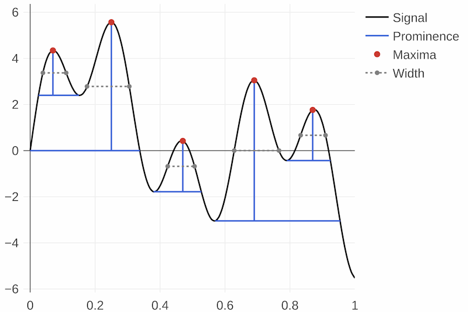

# Peaks.jl

[](https://juliahub.com/ui/Packages/Peaks/3TWUM)
[](https://juliahub.com/ui/Packages/Peaks/3TWUM)
[](https://halleysfifthinc.github.io/Peaks.jl/stable)
[](https://halleysfifthinc.github.io/Peaks.jl/dev)
[](https://github.com/halleysfifthinc/Peaks.jl/actions/workflows/CI.yml)
[](https://codecov.io/gh/halleysfifthinc/Peaks.jl)
[](#)

Peaks.jl contains peak (local extrema) finding functions for vector data. Contributions welcome.

[](#)

```julia
julia> using Peaks

julia> t = 0:1/100:1;

julia> y = 2*sin.(5*t)+3*sin.(10*t)+2*sin.(30*t);

julia> pks, vals = findmaxima(y)
([8, 26, 48, 70, 88], [4.344867409921723, 5.5693856245725195, 0.42179571038522123, 3.050541716751975,
1.765468536605815])

julia> pks, proms = peakproms(pks, y)
([8, 26, 48, 70, 88], [1.9441651653930858, 5.5693856245725195, 2.203426259167901, 6.0957723300230855,
2.195991801053836])

julia> pks, widths, leftedge, rightedge = peakwidths(pks, y, proms)
([8, 26, 48, 70, 88], [7.168551512183585, 13.02544712081329, 8.262715646139178, 13.80559202119737,
7.663187146933097], [4.916043956211862, 18.50125024651451, 43.35170982447645, 63.83409366134414, 84.28425741824285],
[12.084595468395447, 31.5266973673278, 51.61442547061563, 77.63968568254151, 91.94744456517594])

julia> _, proms = peakproms!(pks, y; minprom=3)
([26, 70], [5.5693856245725195, 6.0957723300230855])

```

## Features

- Find peaks (maxima or minima), peak prominence, and peak width
    - Filter peaks by peak spacing (window size), prominence, and width
- Fully supports `NaN`/`missing` with optional tolerance using keyword arg `strict`:
    - Conventional handling/propagation of `NaN`/`missing` when `strict = true` (the default)
      ```julia
      julia> argmaxima([missing,2,0,1,1,0]) # equivalent to [2,0,1,1,0]
      1-element Vector{Int64}:
       4

      julia> peakproms([2,4], [NaN,2,0,1,1,0])
      ([2, 4], [NaN, 1.0])

      julia> peakwidths([2,4], [NaN,2,0,1,1,0], [2,1])
      ([2, 4], [NaN, 2.0], [NaN, 3.5], [2.5, 5.5])
      ```
    - Reasonable alternatives when `strict = false`
      ```julia
      julia> argmaxima([missing,2,0,1,1,0]; strict=false)
      2-element Vector{Int64}:
       2
       4

      julia> peakproms([2,4], [NaN,2,0,1,1,0]; strict=false)
      ([2, 4], [2.0, 1.0])

      julia> peakwidths([2,4], [NaN,2,0,1,1,0], [2,1]; strict=false)
      ([2, 4], [1.5, 2.0], [1.0, 3.5], [2.5, 5.5])
      ```

## Related

- [**Images.jl**](https://github.com/JuliaImages/Images.jl)
  - [`findlocalmaxima`](https://juliaimages.org/stable/function_reference/#Images.findlocalmaxima)/[`findlocalminima`](https://juliaimages.org/stable/function_reference/#Images.findlocalminima)
    - Supports more than 1 dimension
    - Doesn't support `missing`, different window sizes
