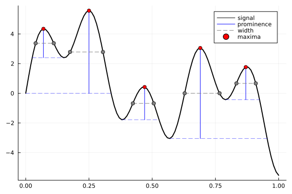

# Peaks.jl

Peaks.jl contains peak (local extrema) finding functions for vector data. Visit the documentation for a complete introduction, how-to guide, and reference. Contributions welcome.

## Features

- Find peak (maxima or minima) locations, height, prominence, and width
    - Filter peaks by peak spacing (window size), height, prominence, and width (including "Full Width Half Maximum (FWHM)")
- Fully supports `NaN`/`missing` with optional tolerance using keyword arg `strict`:
    - Conventional handling/propagation of `NaN`/`missing` when `strict = true` (the default)
    - Reasonable alternatives when `strict = false`

## Related

- [**Images.jl**](https://github.com/JuliaImages/Images.jl)
  - [`findlocalmaxima`](https://juliaimages.org/stable/function_reference/#Images.findlocalmaxima)/[`findlocalminima`](https://juliaimages.org/stable/function_reference/#Images.findlocalminima)
    - Supports more than 1 dimension
    - Doesn't support `missing`, different window sizes
